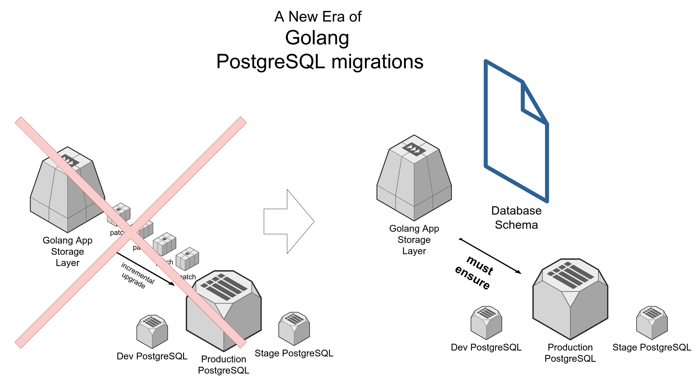

# goerd

This tool allows you to turn schemas into instructions for the database, including migrations between schemas. Create easy-to-read data models as contracts for agreement between architects, development teams, and team leaders.

Features (in progress):

- Generating posgresql migrations as a set of SQL queries that apply changes between two schemas, a schema and a database, or two databases using a yaml schema definition. For yaml schema definition see https://github.com/k1LoW/tbls
- Using diff algorithm https://github.com/covrom/diff
- Using https://github.com/jackc/pgx
- Run as grpc-microservice
- Use as library
