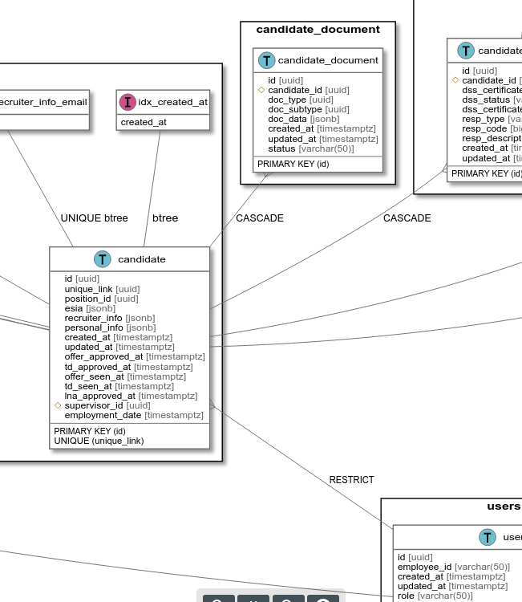

# goerd

This is a New Era of migrations PostgreSQL databases with Golang.

We no longer want to ensure the database schema with incremental patches.
Shema MUST match what the app wants! It doesn't matter what was in the database before that.

It could be empty, it could contain some data in any of its previous versions. It doesn't matter anymore. It is important that we carefully transform it into the target state. We will no longer be guessing about the target state of the database by patchset. This is a thing of the past. 

This tool allows you to turn schemas into instructions for the database, including migrations between schemas. Create easy-to-read data models as contracts for agreement between architects, development teams, and team leaders. This tool provides agility to change the huge data-layered models.


## Install

`go install github.com/covrom/goerd/cmd/goerd@latest`

### Features

- Generate `yaml` short schema description from database
- Generate [plantuml](https://plantuml.com) view of schema
- Create posgresql migrations as a set of SQL queries that apply changes between two schemas, a schema and a database, or two databases using a schema definition that is stored in a yaml or plantuml file.

Example of generated plantuml:



### API

See [docs](https://pkg.go.dev/github.com/covrom/goerd).

### testing and examples 
```docker-compose up``` and see `./output/schema.yaml`